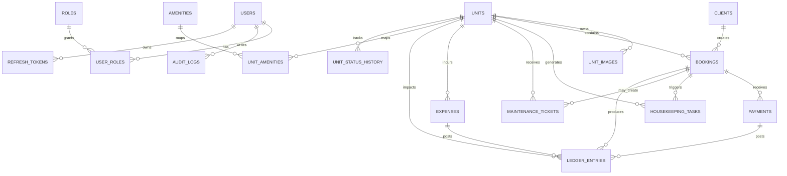

# Backend Architecture Blueprint

## 1. Architectural Principles

- The backend is API-first with all clients consuming versioned REST endpoints under `/api/v1`.
- Clean Architecture is applied with clear boundaries between domain, application, infrastructure, and delivery layers.
- PostgreSQL is the system of record. Redis is reserved for caching, rate limiting, and Celery broker/result backend.
- Financial history is immutable. Corrections happen through reversal records, not destructive updates.
- File objects are stored in S3, while the database keeps only object keys and metadata.
- Unit status is controlled by domain rules, not direct ad hoc updates from clients.
- Every critical mutation writes an audit trail and an outbox event for reliable asynchronous processing.

## 2. Database Schema

### 2.1 Core Tables

| Table | Key Columns | Relationships | Notes |
| --- | --- | --- | --- |
| `users` | `id UUID PK`, `full_name`, `email CITEXT UNIQUE`, `phone`, `password_hash`, `is_active`, `last_login_at`, timestamps | 1:N with `user_roles`, `bookings.created_by`, task assignees | Internal users only |
| `roles` | `id SMALLINT PK`, `code UNIQUE`, `name_ar`, `name_en` | 1:N with `user_roles` | Seeded with `super_admin`, `sub_admin`, `financial`, `operations`, `maintenance`, `housekeeping` |
| `user_roles` | `user_id`, `role_id`, `assigned_at` | FK to `users`, `roles` | Composite PK (`user_id`, `role_id`) |
| `clients` | `id UUID PK`, `full_name`, `email`, `phone`, `nationality`, `id_type`, `id_number`, `is_blacklisted`, `blacklist_reason`, `notes`, timestamps | 1:N with `bookings`, `payments` | CRM master record |
| `units` | `id UUID PK`, `code UNIQUE`, `name`, `category`, `status`, `nightly_rate`, `monthly_rate`, `currency`, `address_line`, `city`, `country`, `latitude`, `longitude`, `bedrooms`, `bathrooms`, `capacity`, `smart_lock_code_encrypted`, `is_active`, timestamps | 1:N with `unit_images`, `bookings`, `expenses`, `housekeeping_tasks`, `maintenance_tickets`, `ledger_entries` | `status` is a domain enum |
| `unit_images` | `id UUID PK`, `unit_id`, `s3_key`, `is_cover`, `sort_order`, timestamps | FK to `units` | Keep only object key, never raw file payload |
| `amenities` | `id UUID PK`, `code UNIQUE`, `name_ar`, `name_en` | M:N with `units` through `unit_amenities` | Shared amenity dictionary |
| `unit_amenities` | `unit_id`, `amenity_id` | FK to `units`, `amenities` | Composite PK (`unit_id`, `amenity_id`) |
| `bookings` | `id UUID PK`, `booking_reference UNIQUE`, `unit_id`, `client_id`, `source_channel`, `status`, `payment_status`, `check_in_at`, `check_out_at`, `guest_count`, `base_amount`, `discount_amount`, `tax_amount`, `security_deposit`, `total_amount`, `outstanding_amount`, `special_requests`, `cancelled_at`, `cancellation_reason`, `created_by`, timestamps | FK to `units`, `clients`, `users` | Holds reservation lifecycle and monetary snapshot |
| `payments` | `id UUID PK`, `booking_id`, `client_id`, `type`, `method`, `status`, `amount`, `currency`, `reference_no`, `receipt_s3_key`, `paid_at`, `recorded_by`, timestamps | FK to `bookings`, `clients`, `users` | Used for rent, deposit, refund, and adjustments |
| `expenses` | `id UUID PK`, `unit_id`, `booking_id NULL`, `category`, `description`, `amount`, `currency`, `expense_date`, `vendor_name`, `attachment_s3_key`, `approved_by`, `created_by`, timestamps | FK to `units`, `bookings`, `users` | Supports unit-level and general operating expenses |
| `ledger_entries` | `id UUID PK`, `unit_id`, `booking_id NULL`, `payment_id NULL`, `expense_id NULL`, `entry_type`, `direction`, `amount`, `currency`, `occurred_at`, `notes`, timestamps | FK to `units`, `bookings`, `payments`, `expenses` | Canonical reporting table for finance dashboards |
| `housekeeping_tasks` | `id UUID PK`, `unit_id`, `booking_id NULL`, `status`, `priority`, `scheduled_for`, `started_at`, `completed_at`, `assigned_to`, `checklist JSONB`, `notes`, timestamps | FK to `units`, `bookings`, `users` | Created automatically after checkout or manually |
| `maintenance_tickets` | `id UUID PK`, `unit_id`, `booking_id NULL`, `status`, `priority`, `title`, `description`, `reported_by`, `assigned_to`, `cost_estimate`, `reported_at`, `resolved_at`, timestamps | FK to `units`, `bookings`, `users` | Drives unit maintenance flow |
| `unit_status_history` | `id UUID PK`, `unit_id`, `from_status`, `to_status`, `reason`, `triggered_by`, `booking_id NULL`, `task_id NULL`, `created_at` | FK to `units`, `users`, `bookings` | Audit table for every status transition |
| `refresh_tokens` | `id UUID PK`, `user_id`, `token_hash`, `expires_at`, `revoked_at`, `created_at`, `user_agent`, `ip_address` | FK to `users` | Enables secure refresh token rotation |
| `audit_logs` | `id UUID PK`, `actor_user_id`, `action`, `resource_type`, `resource_id`, `before_data JSONB`, `after_data JSONB`, `request_id`, `created_at` | FK to `users` | Required for compliance and incident tracing |
| `outbox_events` | `id UUID PK`, `aggregate_type`, `aggregate_id`, `event_type`, `payload JSONB`, `available_at`, `processed_at`, `attempts`, `last_error` | No direct business FK required | Reliable bridge between DB transaction and Celery |

### 2.2 Recommended Enums

- `unit_status`: `vacant`, `reserved`, `occupied`, `pending_cleaning`, `ready`, `maintenance`
- `booking_status`: `pending`, `confirmed`, `checked_in`, `checked_out`, `cancelled`, `no_show`
- `payment_status`: `unpaid`, `partial`, `paid`, `refunded`
- `task_status`: `open`, `in_progress`, `completed`, `blocked`
- `ticket_status`: `open`, `in_progress`, `resolved`, `closed`
- `priority_level`: `low`, `normal`, `high`, `urgent`
- `entry_type`: `booking_revenue`, `security_deposit_hold`, `security_deposit_release`, `refund`, `expense`
- `money_direction`: `credit`, `debit`

### 2.3 ERD (High-Level)



### 2.4 Performance Indexes and Constraints

| Object | Type | Purpose |
| --- | --- | --- |
| `users(email)` | Unique B-tree | Fast login lookup |
| `clients(email)`, `clients(phone)` | B-tree | CRM deduplication and search |
| `clients USING GIN (to_tsvector('simple', coalesce(full_name,'') || ' ' || coalesce(phone,'')))` | Full-text | Fast CRM search by name/phone |
| `units(code)` | Unique B-tree | Stable business identifier |
| `units(status, is_active)` | Composite B-tree | Fast availability filtering |
| `unit_images(unit_id, sort_order)` | Composite B-tree | Ordered image loading |
| `bookings(booking_reference)` | Unique B-tree | External lookup and support workflows |
| `bookings(unit_id, check_in_at)` | Composite B-tree | Calendar and reservation queries |
| `bookings(client_id, created_at DESC)` | Composite B-tree | Customer history queries |
| `bookings(status, check_in_at)` | Composite B-tree | Upcoming arrivals and operational dashboards |
| `bookings(payment_status)` | B-tree | Unpaid and partially paid booking lists |
| `bookings USING GIST (stay_period)` | GIST + exclusion | Prevent overlapping active bookings per unit |
| `housekeeping_tasks(status, scheduled_for)` | Composite B-tree | Daily task board |
| `housekeeping_tasks(assigned_to, status)` | Composite B-tree | Worker task inbox |
| `maintenance_tickets(status, priority)` | Composite B-tree | Urgent open ticket queue |
| `maintenance_tickets(unit_id, status)` | Composite B-tree | Unit maintenance visibility |
| `payments(booking_id, paid_at DESC)` | Composite B-tree | Payment history lookup |
| `payments(status, paid_at)` | Composite B-tree | Reconciliation jobs |
| `expenses(unit_id, expense_date DESC)` | Composite B-tree | Unit profitability reports |
| `ledger_entries(unit_id, occurred_at DESC)` | Composite B-tree | Financial statements by unit |
| `ledger_entries(entry_type, occurred_at DESC)` | Composite B-tree | Revenue and expense reporting |
| `outbox_events(processed_at, available_at)` | Composite B-tree | Efficient polling by outbox publisher |

### 2.5 Critical Database Rules

1. Add `CREATE EXTENSION IF NOT EXISTS btree_gist;` and a generated `stay_period` range on `bookings` using `tstzrange(check_in_at, check_out_at, '[)')`.
2. Enforce an exclusion constraint so the same unit cannot have overlapping bookings while `status IN ('pending', 'confirmed', 'checked_in')`.
3. Use soft delete only for mutable master data such as units and clients. Do not soft delete finance rows; reverse them through journal entries.
4. Encrypt `smart_lock_code_encrypted` at application level before persistence.
5. Add `version INT` optimistic locking columns later only on records with heavy concurrent editing, especially `units`, `maintenance_tickets`, and `housekeeping_tasks`.

## 3. FastAPI Project Structure (Clean Architecture)

```text
backend/
  app/
    main.py
    api/
      dependencies/
        auth.py
        pagination.py
        permissions.py
      errors/
        handlers.py
        schemas.py
      routers/
        v1/
          auth.py
          users.py
          units.py
          bookings.py
          clients.py
          housekeeping.py
          maintenance.py
          finance.py
          reports.py
          files.py
    core/
      config.py
      security.py
      rate_limit.py
      logging.py
      db.py
      enums.py
    domain/
      shared/
        events.py
        exceptions.py
        value_objects.py
      users/
        entities.py
        repositories.py
      units/
        entities.py
        repositories.py
        services.py
      bookings/
        entities.py
        repositories.py
        services.py
      clients/
        entities.py
        repositories.py
      operations/
        entities.py
        repositories.py
        services.py
      finance/
        entities.py
        repositories.py
        services.py
    application/
      dto/
      commands/
      queries/
      use_cases/
        auth/
        units/
        bookings/
        clients/
        housekeeping/
        maintenance/
        finance/
        reports/
    infrastructure/
      persistence/
        models/
        repositories/
        unit_of_work.py
        migrations/
      auth/
        jwt_service.py
        password_hasher.py
      storage/
        s3_service.py
      cache/
        redis_client.py
      queue/
        celery_app.py
        tasks/
          bookings.py
          notifications.py
          housekeeping.py
          maintenance.py
          reconciler.py
      integrations/
        smart_locks/
        notifications/
    schemas/
      auth.py
      units.py
      bookings.py
      clients.py
      operations.py
      finance.py
    tests/
      unit/
      integration/
      contract/
      factories/
  alembic/
  docker/
    api.Dockerfile
    worker.Dockerfile
  compose.yml
```

### 3.1 Layer Responsibilities

- `domain`: pure business rules, entities, repository contracts, domain services, and domain events.
- `application`: use cases and orchestration. This is the only layer that coordinates cross-aggregate workflows.
- `infrastructure`: SQLAlchemy models, repository implementations, S3 adapter, Redis, Celery, JWT, and external integrations.
- `api`: FastAPI routers, request validation, dependency injection, RBAC guards, and response formatting.
- `schemas`: request and response DTOs separated from persistence models.

## 4. API Design

### 4.1 Conventions

- Base path: `/api/v1`
- Auth: Bearer JWT with refresh token rotation
- Pagination for list endpoints: `page`, `page_size`, `sort`, `order`, `q`, plus feature-specific filters
- Standard list response:

```json
{
  "items": [],
  "pagination": {
    "page": 1,
    "page_size": 20,
    "total_items": 240,
    "total_pages": 12
  }
}
```

- Standard error response:

```json
{
  "error": {
    "code": "BOOKING_OVERLAP",
    "message": "The unit is not available for the selected period.",
    "details": {
      "unit_id": "7f9674d7-68a1-4fc2-8c3d-6f20a8ee9fd1"
    },
    "request_id": "3cb58e97-c9ff-4d1f-8fd9-45dad9597654"
  }
}
```

- Include `X-Request-ID` and honor `Idempotency-Key` on booking creation and payment posting.

### 4.2 Endpoint Inventory

| Method | Path | Purpose | Allowed Roles |
| --- | --- | --- | --- |
| `POST` | `/auth/login` | Issue access and refresh tokens | Public |
| `POST` | `/auth/refresh` | Rotate refresh token and issue new access token | Authenticated |
| `POST` | `/auth/logout` | Revoke refresh token | Authenticated |
| `GET` | `/auth/me` | Return current user profile and role claims | Authenticated |
| `GET` | `/users` | List platform users | Super Admin |
| `POST` | `/users` | Create internal user | Super Admin |
| `PATCH` | `/users/{user_id}/roles` | Assign or revoke roles | Super Admin |
| `GET` | `/units` | List units with status, price, city, and availability filters | Admin, Operations, Financial |
| `POST` | `/units` | Create unit | Super Admin, Sub-Admin |
| `GET` | `/units/{unit_id}` | Unit details with images, amenities, and current booking snapshot | Authenticated |
| `PATCH` | `/units/{unit_id}` | Update unit master data | Super Admin, Sub-Admin |
| `POST` | `/units/{unit_id}/images/presign-upload` | Generate S3 upload contract for image | Super Admin, Sub-Admin |
| `GET` | `/units/{unit_id}/calendar` | Reservation and maintenance occupancy calendar | Admin, Operations |
| `GET` | `/bookings` | Filterable booking list by status, date range, unit, client, source, payment status | Admin, Operations, Financial |
| `POST` | `/bookings` | Create booking and reserve unit | Admin, Operations |
| `GET` | `/bookings/{booking_id}` | Booking details and financial snapshot | Admin, Operations, Financial |
| `POST` | `/bookings/{booking_id}/confirm` | Confirm pending booking | Admin, Operations |
| `POST` | `/bookings/{booking_id}/check-in` | Transition guest into unit | Admin, Operations |
| `POST` | `/bookings/{booking_id}/check-out` | Transition booking out and create housekeeping task | Admin, Operations |
| `POST` | `/bookings/{booking_id}/cancel` | Cancel future booking and release unit | Admin, Operations |
| `GET` | `/clients` | Search customers with blacklist filters | Admin, Operations, Financial |
| `POST` | `/clients` | Create client | Admin, Operations |
| `GET` | `/clients/{client_id}` | Client profile with booking history | Authenticated |
| `POST` | `/clients/{client_id}/blacklist` | Blacklist client | Super Admin, Sub-Admin |
| `DELETE` | `/clients/{client_id}/blacklist` | Remove blacklist status | Super Admin |
| `GET` | `/housekeeping/tasks` | Daily housekeeping board | Housekeeping, Operations |
| `POST` | `/housekeeping/tasks/{task_id}/start` | Start cleaning task | Housekeeping, Operations |
| `POST` | `/housekeeping/tasks/{task_id}/complete` | Complete cleaning task and trigger unit transition | Housekeeping, Operations |
| `GET` | `/maintenance/tickets` | Maintenance queue by status and priority | Maintenance, Operations |
| `POST` | `/maintenance/tickets` | Create ticket | Maintenance, Operations, Sub-Admin |
| `POST` | `/maintenance/tickets/{ticket_id}/assign` | Assign technician | Maintenance Lead, Operations |
| `POST` | `/maintenance/tickets/{ticket_id}/resolve` | Mark ticket resolved | Maintenance, Operations |
| `GET` | `/finance/payments` | Payment register | Financial, Super Admin |
| `POST` | `/finance/payments` | Record payment or refund | Financial, Super Admin |
| `GET` | `/finance/expenses` | Expense register | Financial, Super Admin |
| `POST` | `/finance/expenses` | Record expense | Financial, Super Admin |
| `GET` | `/finance/ledger` | Aggregated ledger entries with filters | Financial, Super Admin |
| `GET` | `/reports/dashboard` | KPIs for occupancy, revenue, open tickets, pending cleaning | Admin, Financial, Operations |
| `GET` | `/reports/occupancy` | Occupancy analytics by date range and unit | Admin, Financial |
| `GET` | `/reports/revenue` | Revenue and expense analytics | Financial, Super Admin |
| `POST` | `/files/presign-upload` | Generic S3 pre-signed upload for receipts and attachments | Authenticated |

### 4.3 Business API Rules

1. `POST /bookings` must fail with `409 BOOKING_OVERLAP` if the exclusion constraint is hit.
2. `POST /bookings/{id}/check-in` is valid only from `confirmed` to `checked_in`, and changes unit status to `occupied`.
3. `POST /bookings/{id}/check-out` creates a `housekeeping_tasks` row in the same transaction and sets the unit to `pending_cleaning`.
4. A completed housekeeping task changes the unit to `ready` only when there are no open maintenance tickets for that unit.
5. Financial delete endpoints should not exist. Use reversals and correction flows only.

## 5. Background Tasks Strategy (Celery + Redis)

### 5.1 Queue Layout

- `critical`: payment reconciliation, outbox publication retries, state reconciler
- `operations`: housekeeping and maintenance follow-up jobs
- `notifications`: reminders, overdue alerts, admin summaries
- `integrations`: smart lock sync, external channel notifications, S3 cleanup

### 5.2 Event-Driven Flow

1. API mutation runs inside a database transaction.
2. The use case writes business rows plus one or more `outbox_events` rows.
3. A lightweight publisher process polls `outbox_events`, dispatches Celery tasks, and marks events as processed.
4. Workers execute idempotent tasks keyed by aggregate ID plus event type.
5. Task results never directly skip domain rules; they call application use cases.

### 5.3 Booking Lifecycle Automation

| Trigger | Celery Action | Result |
| --- | --- | --- |
| Booking created | Schedule reminder at `check_in_at - 24h` and readiness pre-check at `check_in_at - 2h` | Operations gets visibility before arrival |
| Check-in completed | Cancel stale pre-arrival reminders, optionally sync smart lock code | Unit remains `occupied` |
| Checkout completed | Create housekeeping task immediately | Unit becomes `pending_cleaning` |
| Housekeeping task completed | Run `evaluate_unit_ready_state` | Unit becomes `ready` unless blocked by maintenance |
| Maintenance ticket opened with urgent severity | Raise operational alert and force unit status to `maintenance` | Booking intake blocked until resolved |
| Ticket resolved | Run `evaluate_unit_ready_state` again | Unit returns to `ready` or `pending_cleaning` based on open work |

### 5.4 Periodic Jobs with Celery Beat

| Schedule | Task | Purpose |
| --- | --- | --- |
| Every 5 minutes | `reconcile_booking_and_unit_states` | Fix drift between booking status, tasks, and unit status |
| Every 15 minutes | `dispatch_due_outbox_events` | Ensure no domain event is stuck |
| Hourly | `send_upcoming_arrival_reminders` | Notify operations and optionally guests |
| Hourly | `flag_overdue_checkouts` | Raise alerts for units not checked out on time |
| Daily at 00:05 | `build_daily_ops_digest` | Summary for housekeeping, maintenance, and occupancy |
| Daily at 01:00 | `archive_finance_snapshots` | Materialized reporting cache refresh |

### 5.5 Reliability Rules

1. Every Celery task must be idempotent. Replays should not duplicate housekeeping tasks, payments, or status changes.
2. Use `retry_backoff=True`, capped retries, and dead-letter logging for failed tasks.
3. Persist task correlation fields: `request_id`, `aggregate_id`, `event_type`.
4. Never let Celery modify SQLAlchemy models directly from task code without going through application services.
5. Run a reconciliation job even when event-driven flows are correct; it is the safety net for distributed failures.

### 5.6 Minimal Programmatic Pattern

```python
# inside application use case
booking = booking_service.create_booking(command)
outbox_repo.add(
    aggregate_type="booking",
    aggregate_id=booking.id,
    event_type="booking.created",
    payload={"booking_id": str(booking.id)}
)

# inside outbox publisher worker
celery_app.send_task(
    "tasks.bookings.schedule_booking_journey",
    kwargs={"booking_id": event.payload["booking_id"]},
    queue="operations"
)
```

This keeps booking creation transactional while still enabling asynchronous reminders, housekeeping generation, and operational follow-up.